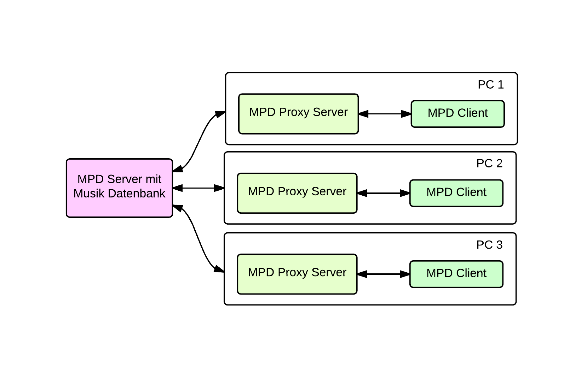

:title: go-lang
:author: Christopher Pahl, Christoph Piechula
:description: The Hovercraft! tutorial.
:keywords: presentation, backend, impress.js, hovercraft, go-lang
:css: presentation.css

----

.. utility roles

.. role:: underline
    :class: underline

.. role:: blocky
   :class: blocky

.. role:: tiny
   :class: tiny

:id: first 

Snøbær

.. note::

   Hallo zusammen.

----

:blocky:`Was ist Snøbær?`

.. note::

    - Snøbær ist ein MPD--Client für den Browser.
    - Umfrage: Wer kennt den MPD? (Aha, die Linux Nutzer outen sich...)

----

.. image:: ../pics/mpd-overview.png
   :width: 120%

.. note::

    - MPD erklären für die Leute die ihn nicht kennen.
    - Outputs, Inputs, Netzwerkservice, verschiedene MPD-Clients
      als Fernbedienung.
    - Es gibt über 200 MPD Clients, viele aber kaputt.

----

.. note::

    - Beispiel Setup in unserer WG
    - Ein MPD Masterserver mit Musikdatenbank und Files.
    - Ein Proxyserver pro PC der die Datenbank spiegelt.
    - Der Nutzer kontrolliert den MPD dann mit einem
      MPD Client seiner Wahl.
    - Snøbær sehr geeignet für Touchdevices wie Tablets.

----

.. image:: ../pics/playing.png
   :width: 120%

.. note::

    - Okay, was hat das num mit Snøbær zu tun?
    - Snøbær ist eine Webanwendung die sich zu einem MPD Server 
      nach Wahl connected und 
    - Sehr grob Screenshotinhalte zeigen und MPD Konzepte erklären.

----

.. note::

    - Architektur von Snøbær schaut ca. so aus.
    - Benutzte Frameworks Flask + Tornado (verbunden mit WGSI Container)
    - libmoosecat für Verbindung mit dem MPD. 
      Eine C Bibliothek mit speziellen Features wie Volltextsuche.
    - Auf Frontendseite: Bootstrap + Coffescript + jQuery.

    - Spezielle Features:

      - Metadata (coverart) Retrieval
      - Volltextsuche und Autovervollständigung
      - Responsive Design

----

.. code-block:: bash

   $ ./demo

----

:class: fin

:blocky:`Danke für die Aufmerksamkeit.`

|

.. code-block:: bash

    $ git clone https://github.com/studentkittens/snobaer
    $ $(Geduldiges Kompilieren)

`↑ oder ↓`

.. code-block:: bash

    $ docker pull sahib/snobaer
    $ docker run -p 6666:6666 -p 8080:8080 sahib/snobaer /start.sh
    $ your-browser localhost:8080

.. note::

    - Quelltext ist unter GPL lizensiert auf GitHub zu finden.
    - Wer's ausprobieren möchte kann auch den Docker Container oben nutzen.
    - Fragen?
