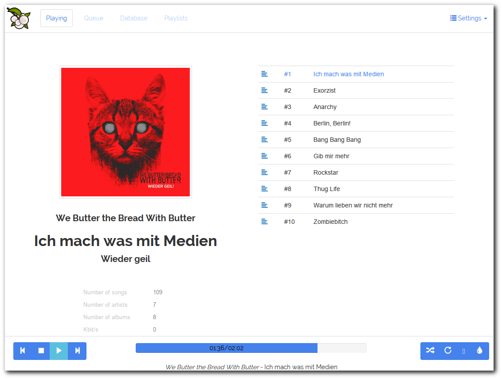

:title: go-lang
:author: Christopher Pahl, Christoph Piechula
:description: The Hovercraft! tutorial.
:keywords: presentation, backend, impress.js, hovercraft, go-lang
:css: presentation.css

----

.. utility roles

.. role:: underline
    :class: underline

.. role:: blocky
   :class: blocky

.. role:: tiny
   :class: tiny

:id: first 

Snøbær

.. note::

   stuff

----

:blocky:`Was ist Snøbær?`

----

----

.. image:: ../pics/proxy.png
   :width: 120%

----

----

.. image:: ../pics/architektur.png
